  

<table>
  <tr>
    <td valign="middle"></td>
    <td valign="top"></td>
  </tr>
</table>

<!-- HERO -->

  <h3><strong>Desenvolvedor de Software | React, Next.js e TypeScript</strong></h3>
  
<strong>Arquitetura Front-end • Design Systems • Performance • Node.js & NestJS</strong>

  
<i>Transformando ideias em código: aplicações web modernas, acessíveis e performáticas.</i>

  

    
    
    
    
    
    
  

  

 

<!-- SOBRE MIM -->
<h2 align="center">🚀 Sobre Mim</h2>

<table width="100%">
<tr>
<td width="40%" valign="top">

### 👨‍💻 Quem sou eu?

* 💻 **Desenvolvedor de Software** com atuação principal em Front-end.
* ⚛️ Trabalho com **React, Next.js e TypeScript**, arquitetura Front-end, Design Systems, performance e acessibilidade.
* 🏢 **Desenvolvedor Front-end na ProBrain**, atuando em diferentes aplicações React e Next.js.
* 🤝 **Fundador e Líder Técnico** da Comunidade [Café Bugado](https://github.com/cafebugado).
* 🧩 Também desenvolvo APIs e aplicações com **Node.js, NestJS, PostgreSQL, Supabase e Prisma**.
* 🌱 Atualmente aprofundando conhecimentos em **engenharia e arquitetura de software e aplicações de IA**.

<blockquote>
  

    <i>"Código limpo sempre parece ter sido escrito por alguém que se importa."</i> — Robert C. Martin
  

</blockquote>

</td>

<td width="60%" align="center" valign="middle">

</td>
</tr>
</table>

---

<!-- COMUNIDADE & CONTEÚDO -->

  

  
  
  
  

<table align="center" width="100%">
  <tr>
    <td align="center" width="50%">
      
    </td>
    <td align="center" width="50%">
      
    </td>
  </tr>
</table>

  

---

### 🏅 Destaques

- 🏢 **Desenvolvedor Front-end** — ProBrain
- ☕ **Fundador e Líder Técnico** — Comunidade Café Bugado
- 🎓 **Mentoria e onboarding** de desenvolvedores
- 🧩 **Experiência Full Stack** com Node.js, NestJS, PostgreSQL, Supabase e Prisma
- 🌐 Projetos reais e aplicações em produção em [darioreis.dev](https://darioreis.dev)

<!-- EXPERIÊNCIA ATUAL -->
<h2>💼 Experiência Atual</h2>

<table width="100%">
  <tr>
    <td width="50%" valign="top">
      <h3>🏢 ProBrain | Desenvolvedor Front-end</h3>
      

        <code>React</code> <code>Next.js</code> <code>TypeScript</code> <code>Material UI</code> <code>Redux</code> <code>Storybook</code> <code>Sentry</code>
      

      
Atuação no desenvolvimento e evolução de aplicações web, arquitetura Front-end, Design Systems, acessibilidade, performance, integração com APIs, code review, observabilidade, documentação técnica e CI/CD.

    </td>
    <td width="50%" valign="top">
      <h3>☕ <a href="https://github.com/cafebugado">Café Bugado</a> | Fundador & Líder Técnico</h3>
      

        <code>Next.js</code> <code>React</code> <code>Angular</code> <code>TypeScript</code> <code>Node.js</code> <code>NestJS</code> <code>PostgreSQL</code> <code>Supabase</code> <code>Prisma</code>
      

      
Atuação em liderança técnica, arquitetura, desenvolvimento Front-end e Back-end, APIs REST, code review, testes automatizados, CI/CD, segurança, documentação técnica, planejamento e mentoria de desenvolvedores.

    </td>
  </tr>
</table>

<!-- TECH STACK -->
<h2>⚡ Tech Stack & Ferramentas</h2>

<table width="100%" align="center">
  <tr>
    <td width="50%" valign="top">
      <h3>🎨 Frontend</h3>
      
        
      <h3>⚙️ Backend</h3>
      
       APIs REST
        
      <h3>🗄️ Dados</h3>
      
        
      <h3>☁️ DevOps & Observabilidade</h3>
      
       Docker principalmente em ambiente local
    </td>
    <td width="50%" valign="top">
      <h3>🔄 Estado & Dados</h3>
      

        
        
         Redux Toolkit • Redux-Saga • Zustand • Context API
      

       
      <h3>🧩 UI & Design System</h3>
      

        
        
         ShadCN UI • Tailwind CSS • Sass/SCSS • Styled Components • Emotion
      

       
      <h3>🧪 Testes & Qualidade</h3>
      

        
        
        
         Testing Library • Cypress • Supertest • ESLint • Prettier • Husky • Commitlint
      

       
      <h3>🤖 Inteligência Artificial</h3>
      
Integração de APIs de IA em aplicações e uso de ferramentas de IA no desenvolvimento.

    </td>
  </tr>
</table>

  <strong>Também já utilizei em projetos e estudos:</strong> Angular • Vue.js • GraphQL • Python • FastAPI • Flask • MongoDB • Bun • Elysia • Drizzle ORM • Java • Spring Boot • React Native (estudo e prototipação) • AWS (estudo e integrações pontuais)

<!-- PROJETOS -->
<h2>🗂️ Projetos em Destaque</h2>

<table width="100%">
  <tr>
    <td width="50%" valign="top">
      <h3>☕ <a href="https://github.com/cafebugado">Café Bugado</a></h3>
      
Ecossistema de aplicações da comunidade: site oficial, agenda de eventos, painel administrativo e APIs, sob minha liderança técnica e arquitetura.

      

        <code>Next.js</code> <code>Angular</code> <code>NestJS</code> <code>PostgreSQL</code> <code>Supabase</code> <code>Prisma</code>
      

      <ul>
        <li>✔ CI/CD, testes automatizados, segurança e documentação técnica</li>
        <li>✔ No ar em <a href="https://cafebugado.com.br">cafebugado.com.br</a></li>
      </ul>
    </td>
    <td width="50%" valign="top">
      <h3>🧑‍💻 <a href="https://github.com/darioreisjr/portifolio_2026">Portfólio 2026</a> + <a href="https://github.com/darioreisjr/api_portfolio_26">API</a></h3>
      
Portfólio inspirado no VS Code, com PWA e internacionalização, alimentado por uma API própria para projetos, tecnologias e categorias.

      

        <code>React</code> <code>TypeScript</code> <code>Vite</code> <code>Tailwind CSS</code> <code>ShadCN UI</code> <code>React Query</code> <code>NestJS</code> <code>Prisma</code> <code>PostgreSQL</code> <code>Supabase</code>
      

      <ul>
        <li>✔ API com JWT, Swagger, paginação, filtros e camadas de segurança</li>
        <li>✔ CI/CD e deploy na Vercel, no ar em <a href="https://darioreis.dev">darioreis.dev</a></li>
      </ul>
    </td>
  </tr>
  <tr>
    <td width="50%" valign="top">
      <h3>⚽ <a href="https://github.com/darioreisjr/copadomundo2026">Bolão Copa do Mundo 2026</a></h3>
      
Aplicação web de bolão com apostas de placar, ranking em tempo real e geração de jogos via IA.

      

        <code>Vue 3</code> <code>Vuetify</code> <code>Pinia</code> <code>Supabase</code> <code>PostgreSQL</code> <code>Google Gemini</code>
      

      <ul>
        <li>✔ Auth, RLS e Storage do Supabase, com regras de negócio de pontuação</li>
        <li>✔ No ar em <a href="https://bolaocopa26.darioreis.dev/">bolaocopa26.darioreis.dev</a></li>
      </ul>
    </td>
    <td width="50%" valign="top">
      <h3>💬 <a href="https://github.com/darioreisjr/whatsapp-ranking-nextjs">WhatsApp Ranking</a></h3>
      
Analisa chats exportados do WhatsApp e mostra quem mais participa das conversas em grupo.

      

        <code>Next.js</code> <code>React</code> <code>TypeScript</code> <code>Tailwind CSS</code> <code>PWA</code>
      

      <ul>
        <li>✔ Processamento local no navegador: privado, gratuito e sem cadastro</li>
        <li>✔ No ar em <a href="https://whatsappranking.darioreis.dev/">whatsappranking.darioreis.dev</a></li>
      </ul>
    </td>
  </tr>
  <tr>
    <td width="50%" valign="top">
      <h3>💜 <a href="https://github.com/darioreisjr/WeMoment">WeMoment</a></h3>
      
Aplicativo web responsivo para casais planejarem, organizarem e eternizarem os momentos vividos juntos.

      

        <code>React</code> <code>TypeScript</code> <code>Vite</code> <code>Tailwind CSS</code> <code>Supabase</code>
      

      <ul>
        <li>✔ Compromissos, sonhos e memórias em um só lugar</li>
        <li>✔ No ar em <a href="https://wemoment.com.br">wemoment.com.br</a></li>
      </ul>
    </td>
    <td width="50%" valign="top">
      <h3>🌬️ <a href="https://github.com/darioreisjr/kokyu">Kokyu</a></h3>
      
Central para gerenciar a vida cotidiana: trabalho, estudos, saúde, hábitos, metas, finanças e rotina diária.

      

        <code>Next.js</code> <code>TypeScript</code> <code>Material UI</code> <code>Supabase</code> <code>Vitest</code> <code>Playwright</code> <code>Storybook</code>
      

      <ul>
        <li>✔ Testes unitários e E2E, com componentes documentados no Storybook</li>
        <li>✔ No ar em <a href="https://kokyu.darioreis.dev">kokyu.darioreis.dev</a></li>
      </ul>
    </td>
  </tr>
</table>

<!-- EXPERIÊNCIA -->
<h2>🛠️ Experiência em Engenharia</h2>

Competências que aplico no dia a dia, da interface à entrega em produção.

<table width="100%">
  <tr>
    <td width="33%" valign="top">
      <h3>🎨 Frontend</h3>
      <ul>
        <li>React & Next.js</li>
        <li>Arquitetura Front-end</li>
        <li>Design Systems</li>
        <li>Performance Web</li>
        <li>Acessibilidade</li>
      </ul>
    </td>
    <td width="33%" valign="top">
      <h3>🌐 Backend</h3>
      <ul>
        <li>Node.js & NestJS</li>
        <li>APIs REST</li>
        <li>Autenticação</li>
        <li>PostgreSQL</li>
        <li>Supabase & Prisma</li>
      </ul>
    </td>
    <td width="34%" valign="top">
      <h3>🧪 Qualidade</h3>
      <ul>
        <li>Testes automatizados</li>
        <li>Code Review</li>
        <li>Storybook</li>
        <li>CI/CD com GitHub Actions</li>
        <li>Conventional Commits & SemVer</li>
      </ul>
    </td>
  </tr>
  <tr>
    <td width="33%" valign="top">
      <h3>🔐 Observabilidade & Segurança</h3>
      <ul>
        <li>Sentry</li>
        <li>CORS, Helmet e rate limiting</li>
        <li>Autenticação & autorização</li>
        <li>Segurança Front-end</li>
      </ul>
    </td>
    <td width="33%" valign="top">
      <h3>⚡ Web & Entrega</h3>
      <ul>
        <li>Core Web Vitals & Lighthouse</li>
        <li>SEO técnico</li>
        <li>Internacionalização</li>
        <li>Documentação técnica</li>
      </ul>
    </td>
    <td width="34%" valign="top">
      <h3>🤝 Liderança</h3>
      <ul>
        <li>Liderança técnica</li>
        <li>Mentoria & onboarding</li>
        <li>Planejamento técnico</li>
        <li>Definição de padrões</li>
      </ul>
    </td>
  </tr>
</table>

<!-- AGORA -->
<h2>🔭 No Que Estou Trabalhando Agora</h2>

  <strong>🚀 Foco atual:</strong> 
  Arquitetura Front-end • Design Systems • Performance Web • Engenharia e Arquitetura de Software • Next.js • NestJS • CI/CD • Qualidade de Software • Aplicações de IA • Evolução dos projetos da <a href="https://github.com/cafebugado">Café Bugado</a>

<!-- GITHUB STATS -->
<h2>📈 GitHub Analytics & Atividade Open Source</h2>

  

    
  

  

    
  

  

    
  

